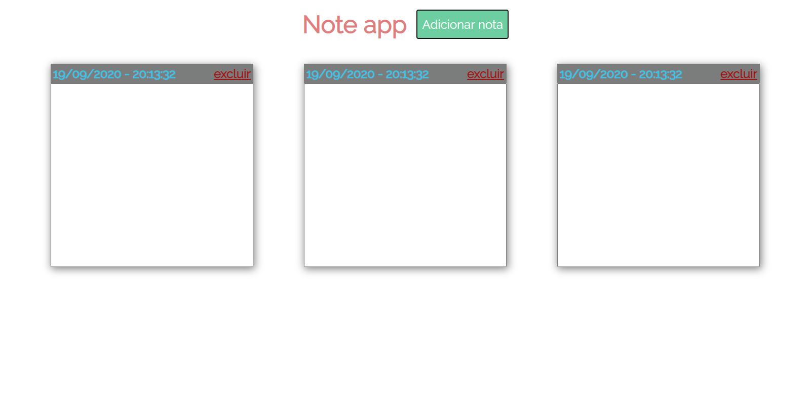
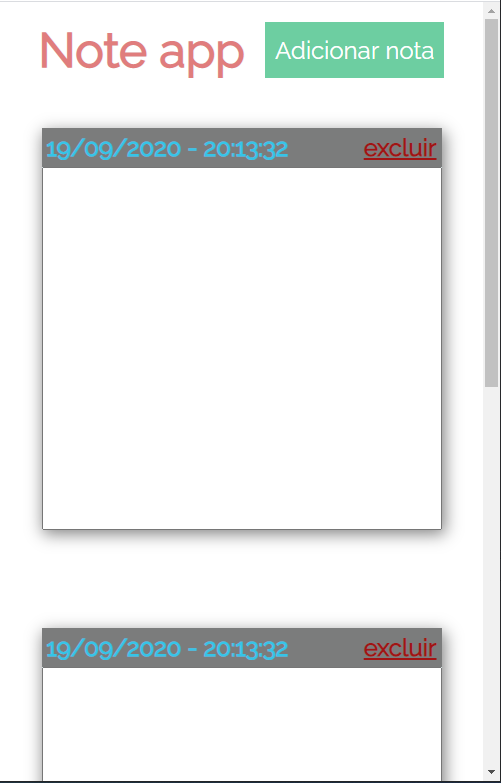

<h1>Notes application</h1>

  Note creation application 

## Built With

    <ul>
        <li><a href="https://developer.mozilla.org/pt-BR/docs/Aprender/JavaScript">JavaScript</a></li>
        <li><a href="https://developer.mozilla.org/pt-BR/docs/Web/HTML">Html</a></li>
        <li><a href="https://developer.mozilla.org/pt-BR/docs/Web/CSS">Css</a></li>
       <li><a href="https://gulpjs.com/">Gulp</a></li>
      <li><a href="https://sass-lang.com/documentation/syntax">Scss</a></li>
    </ul>

## Images

## License

This project is licensed under the MIT License - see the [LICENSE.md](LICENSE.md) file for details
